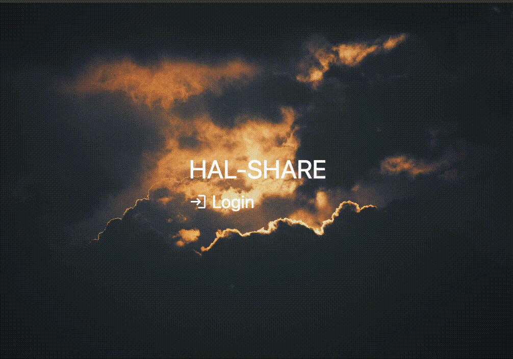
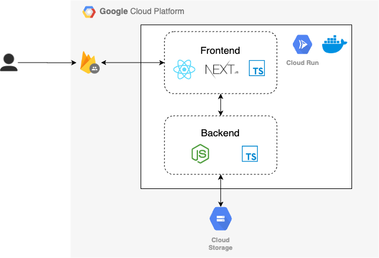

# file-share - プライベートメンバー用クラウドファイルシェアアプリ

This is a [Next.js](https://nextjs.org/) project bootstrapped with [`create-next-app`](https://github.com/vercel/next.js/tree/canary/packages/create-next-app).

## What is this?

(エレベーターピッチ)

- `安価でファイル共有` がしたい
- `複数人で活動しているチーム` 向けの、
- `file-share` というアプリは、
- `プライベートメンバー向けクラウドストレージサービス` である。
- これは `安価でチーム内でのファイル共有` ができ、
- `GoogleDriveやDropBox` とは違って、
- `プランや容量を気にせず圧倒的安価でファイルを保管・共有することができる機能` が備わっている。

## 機能

- 事前にホワイトリストに登録した Google アカウントでの認証
- ブラウザ上でのファイルアップロード/ダウンロード/削除

### デモ



## 実行方法

### 実行環境

```
node: >= v18.12
next: 14.0.4
react: 18.2.0
```

### アプリの起動方法

(ローカルの場合)

1. `key-sa-storage.json` に自身の情報を追記する
2. アプリを起動
   ```bash
   yarn dev
   ```
3. ブラウザ上で[http://localhost:3000](http://localhost:3000)にアクセスする

---

(クラウド上へのデプロイの場合)

1. イメージの build と GCR への push

```
docker build --platform linux/amd64 -t <タグ名> .
docker push gcr.io/<push先>
```

2. GCR 上で下記の環境変数を指定のうえデプロイ
   - `NEXT_PUBLIC_FIREBASE_API_KEY`: Firebase におけるパブック API キー
   - `NEXT_PUBLIC_FIREBASE_AUTH_DOMAIN`: Firebase 上で設定しているドメイン名(`xxx.firebaseapp.com`)
   - `NEXT_PUBLIC_FIREBASE_PROJECT_ID`: Firebase のプロジェクト名
   - `NEXT_PUBLIC_FIREBASE_STORAGE_BUCKET`: Firebase におけるストレージバケット名
   - `NEXT_PUBLIC_FIREBASE_MESSAGING_SENDER_ID`: Firebase におけるメッセージング送信用 ID
   - `NEXT_PUBLIC_FIREBASE_APP_ID`:
   - `GCP_PROJECT_ID`: GCP におけるプロジェクト名
   - `BUCKET_NAME`: GCS のバケット名
   - `ALLOWED_EMAILS`: ログイン可能な Google アカウント(メールアドレス)
3. GCR で定義された URL(`https://xxx.a.run.app`)からアクセス

## 技術スタック

- フロントエンド: Next.js / React / TypeScript
- バックエンド: Node.js / TypeScript
- インフラ: GoogleCloud, Firebase
  - 認証: Firebase Authentication
  - ストレージ: CloudStorage
  - デプロイ: Docker on CloudRun

### 構成概要図


